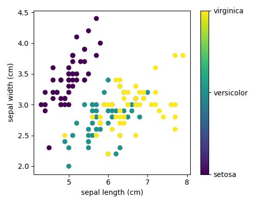

# Questão2
2 . Dado o gráfico de dispersão abaixo, descrevendo duas características de três diferentes espécies de plantas, na qual cada cor indica uma espécie diferente. Como você faria para saber qual é a espécie de uma planta com sepal width igual 3.2 e sepal length igual 6.3? Explique seu raciocínio, quanto mais detalhada for a explicação melhor será o nosso entendimento.

### Resposta
Baseando no gráfico dado, não é possível classificar a planta somente olhando no gráfico, então eu pegaria fonte de dados no qual foi gráfico foi plotado e desenvolver um classificador utilizando o conceito de Machine Learning(Aprendizagem de Máquina) nos dados que o gráfico foi plotado, então para uma atividade como essa eu normalmente utilizo a linguagem Python,  baseado nisto faria um exploração nos dados disponibilizados para encontrar as melhores Features, há a questão de ter inconsistências e dados faltantes do datasheet, para isso o será feito um pré-processamento nos dados conforme forem tratados. Após ter de selecionar alguns dados irei selecionar alguns modelos de uma biblioteca (SKlearn) para começar a fazer os testes com a classificação da planta que foi passada.
